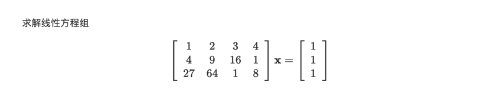
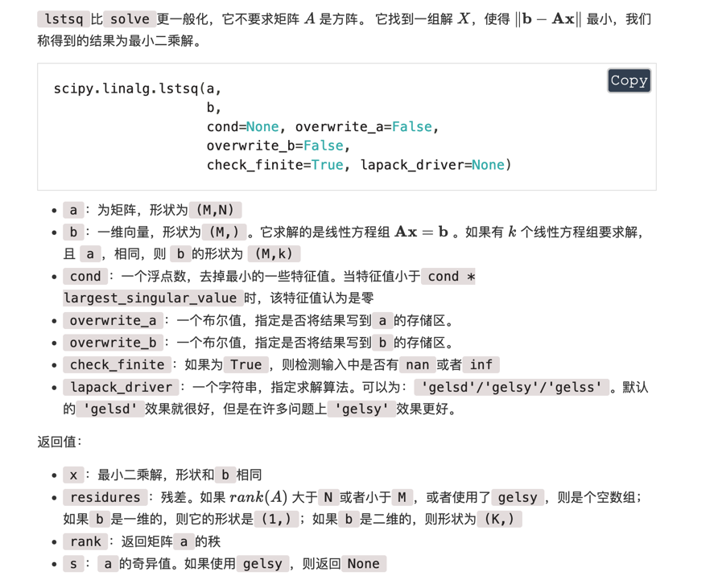

# linear的核心是

[中文文档](https://hg95.github.io/numpy-pandas-scipy/Chapter3/线性代数linalg/最小二乘解lstsq.html)
[Scikit-Learn linear源码解读](https://blog.csdn.net/ybdesire/article/details/67701289)




```python
import numpy as np
from scipy.linalg import lstsq

a = np.array([[1, 2, 3, 4], [4, 9, 16, 1], [27, 64, 1, 8]])
b = np.array([1, 1, 1])
lstsq(a, b)
```

输出

(array([ 0.00205847, -0.01287038,  0.0558478 ,  0.21403472]), array([], dtype=float64), 3, array([70.75236556, 15.95524212,  3.67872487]))



> 调用底层的C函数做求解计算 


原来这些gelsd, gelsy, gelss，是C函数名，函数是从LAPACK—Linear Algebra PACKage中拿到的。

**gelsd**：它是用singular value decomposition of A and a divide and conquer method方法来求解线性回归方程参数的。

**gelsy**：computes the minimum-norm solution to a real/complex linear least squares problem

**gelss**：Computes the minimum-norm solution to a linear least squares problem using the singular value decomposition of A.
